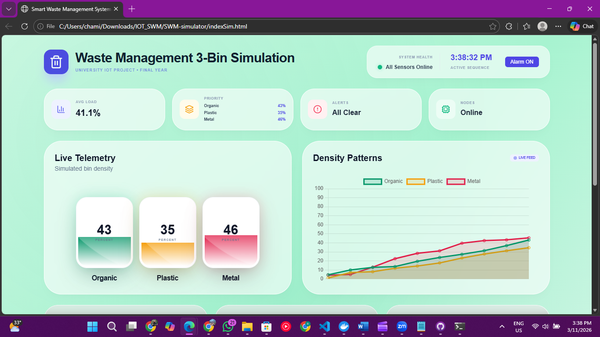
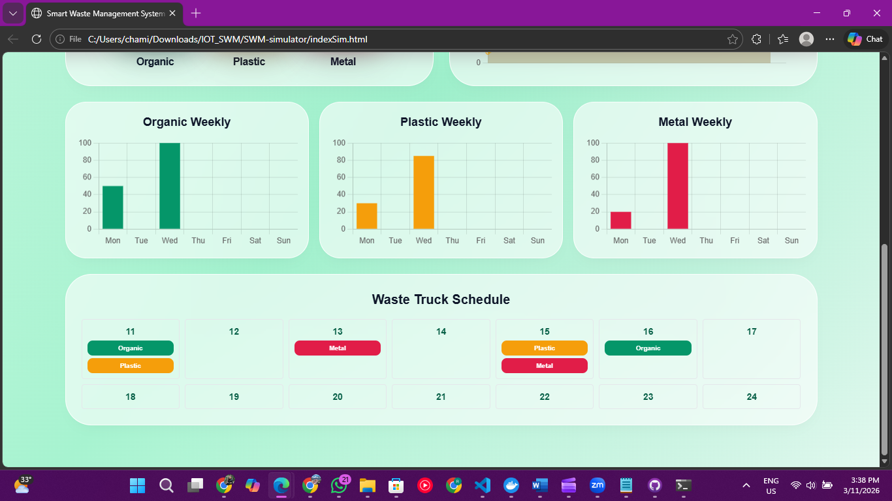

Smart Waste Management System (IoT)
Smart Bin with ESP32 + Firebase + Live Dashboard

An IoT-based Smart Waste Management System that monitors waste bin fill levels using an ESP32 microcontroller and ultrasonic sensor, streams real-time data to Firebase Realtime Database, and visualizes telemetry through a web dashboard built with HTML, Tailwind CSS, and Chart.js.

The system helps monitor bin status, trigger alerts when bins are nearly full, and visualize waste trends for efficient waste management.

📊 Dashboard Preview

(Add your dashboard screenshot here)

📌 Project Overview

The system consists of three main components.

1️⃣ IoT Hardware Node

ESP32 microcontroller

HC-SR04 Ultrasonic Sensor

Measures distance from sensor to waste surface

Converts distance into bin fill percentage (0–100%)

2️⃣ Cloud Database

Uses Firebase Realtime Database

ESP32 uploads telemetry data

Dashboard reads live data

3️⃣ Web Dashboard

Displays real-time bin fill percentage

Shows historical trends

Generates alerts when bins are nearly full

🏗 System Architecture
Ultrasonic Sensor
        │
        ▼
      ESP32
        │
        ▼
Firebase Realtime Database
        │
        ▼
Web Dashboard (HTML + Tailwind + Chart.js)
🛠 Technologies Used
Hardware

ESP32

HC-SR04 Ultrasonic Sensor

Software

HTML

Tailwind CSS

Chart.js

JavaScript

Firebase Realtime Database

Tools

Wokwi IoT Simulator

Arduino IDE

GitHub

📂 Repository Structure
Smart-Waste-Management-IoT-Smart-Bin-Real-Hardware-Dashboard-

│
├── SWM_system/
│   └── ESP32 firmware code
│
├── SWM-simulator/
│   └── Simulation files
│
├── dustbin wokwi/
│   └── Wokwi simulation project
│
├── index.html
│   └── Smart dashboard interface
│
├── beep.mp3
│   └── Alarm sound used by dashboard
│
└── README.md
📊 Dashboard Features
🔴 Real-Time Monitoring

Displays current bin fill percentage

Automatically updates from Firebase

📈 Data Visualization

Line chart showing recent bin levels

Weekly waste statistics

⚠ Alert System
Fill Level	Alert
> 80%	Warning – Bin almost full
> 90%	Critical alert + alarm sound
🎛 Interactive Controls

Alarm enable/disable toggle

Visual indicators for bin status

🔥 Firebase Database Structure

The ESP32 sends data to:

/dustbin
    filled_percentage: 0 – 100

Example JSON:

{
  "dustbin": {
    "filled_percentage": 72
  }
}
💻 ESP32 Firmware Example

Example Arduino code to send bin data to Firebase.

#include <WiFi.h>
#include <FirebaseESP32.h>

#define FIREBASE_HOST "your-project-id-default-rtdb.firebaseio.com"
#define FIREBASE_AUTH "your-database-secret"

FirebaseData fbdo;

void setup() {
  WiFi.begin("YOUR_WIFI", "YOUR_PASSWORD");
  Firebase.begin(FIREBASE_HOST, FIREBASE_AUTH);
}

void loop() {
  float filled = random(0,100);
  Firebase.setFloat(fbdo, "/dustbin/filled_percentage", filled);
  delay(5000);
}
🔌 Hardware Wiring
Sensor	ESP32
TRIG	GPIO 5
ECHO	GPIO 18
VCC	5V
GND	GND

⚠ Note:
If the ultrasonic sensor outputs 5V, use a voltage divider for the ECHO pin.

🧪 Wokwi Simulation

The project can also be tested using the Wokwi IoT Simulator.

Simulation includes:

ESP32 virtual board

Ultrasonic sensor slider

Real-time fill level testing

This allows verification of the logic before deploying on real hardware.

🚀 Deployment (GitHub Pages)

The dashboard can be hosted using GitHub Pages.

Steps

Open repository Settings

Go to Pages

Select branch main

Click Save

Your dashboard will be available at:

https://chamikacc.github.io/Smart-Waste-Management-IoT-Smart-Bin-Real-Hardware-Dashboard-/
🔒 Security Notes

Since this repository contains Firebase configuration:

Recommended improvements for production:

Restrict Firebase database rules

Use authentication for write access

Avoid exposing sensitive keys in public repositories

